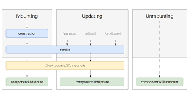

## How do you create Nested Routes react-router-dom configuration? 

There are two ways to create nested routes using react-router-dom configuration:

1. using createBrowserRouter: This method involves creating a router instance with nested router using <b>createBrowserRouter</b>. Routes are defined as an array of objects, where each object represents a route configuration. Children routes are declared within the <b>children</b> property of the parent route.
```jsx
  const route = createBrowserRouter([
    {
      path: "/",
      element: <Dashboard/>,
      children: [
        {
          path: "profile",
          element: <Profile/>
        },
        {
          path: "about",
          element: <About/>
        }
      ]
    }
  ])

  const root = ReactDOM.createRoot(document.getElementById('root'));
  root.render(
    <RouterProvider router={router} />
  )
```

2. using Routes and Route component: This method involves using the <b>Routes</b> and <b>Route</b> components provided by <b>react-router-dom</b>. Nested routes are declared within the "Route" component of their parent route.

```jsx
  <Routes>
    <Route path="/" element={<Dashboard/>}>
      <Route path="profile" element={<Profile/>}/>
      <Route path="about" element={<About/>}/>
    </Route>
  </Routes>
```

## What is the order of life cycle method calls in Class Based Components?

The life cycle of Class-based components happens in two phases:-
1) render phase:- In this phase, React performs these major operations, it computes changes of the components based on the states and props. Then it undergoes reconciliation to identify the differences between the previous virtual DOM and the current one. React then invokes render method of each component and generates a virtual DOM representation of its components and its children. React finally updates the virtual DOM.

2) commit phase:- After the render phase is completed, React updates the real DOM with reference to the updated virtual DOM, to minimize the number of DOM manipulation it updates the DOM in batches. After the DOM is updates React then invokes the lifecycle methods like componentDidMount, componentDidUpdate and componentWillUnmount. Finally, after the changes are commited and all the lifecycle methods are invoked, the user can see the updated UI.

The order of life cycle method calls in Class-Based Components are-

1) Mounting: When an instance of the class is created the first method called in the life cycle of a component is constructor, it initializes state. After which the render() method is called, which reads the props and states and return JSX elements to the root of the application. These occurs in render phase, after which in the commit phase the componentDidMount method is called which handles side effects like data fetching, timers or DOM update.

2) Updating: This cycle occurs in two phases, render and commit phase. In the render phase the components are updated based on the sates and props. It invokes render method of each component and generates a virtual DOM based on the findings of reconciliations. Then in the commit phase the componentDidUpdate method is called to reflect the changes in the real DOM.

3) Unmounting: When a component unmounts which means that when the component is removed from DOM, componentWillUnmount method is called to clean up side-effects like canceling network request or invalidating timer, etc.

A diagram of lifecycle method is attached below:



## Why do we use componentDidMount?

The componentDidMount is called just after the component is mounted. This method is used to handle side effects like data fetching, timers or DOM update. It's a common practice to initiate API calls or data fetching in componentDidMount. Since this method runs after the first render, it ensures that you have a component structure ready, allowing you to populate it with data from the API response effectively.

## Why do we use componentWillUnmount? Show with example.
The componentWillUnmount method is called to clean up side-effects like canceling network request or invalidating
timer, etc.

```jsx
import React from 'react';

class ClassComponent extends React.Component{
  constructor(props){
    super(props);
  }

  componentDidMount(){
    this.timer = setInterval(()=>{
      console.log("Interval every 1s");
    },1000)
  }

  componentWillUnmount(){
    clearInterval(this.timer);
  }

  render(){
    return(
      <div className="parent" >
        <h1>Class Component</h1>
        <p>Content...</p>
      </div>
    )
  }
}

export default ClassComponent;
```